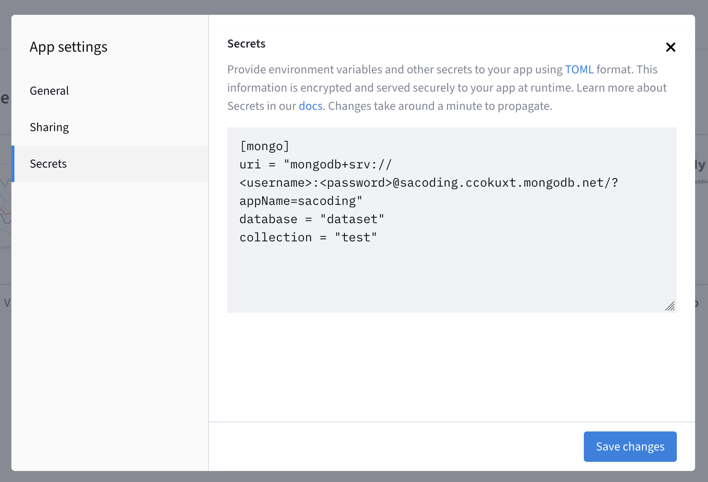
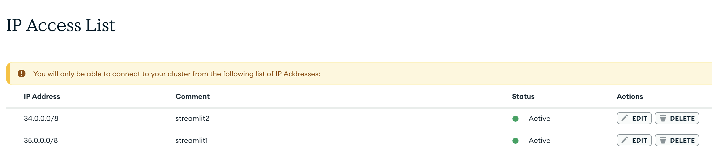

[](https://doi.org/10.4230/LIPIcs.ESEM.2026.15)
# SAcoder

A small web tool for applying the SAcoding methodology to security advice, plus the scripts used to evaluate how consistently two coders apply it.

## Overview

Security advice is everywhere, but it varies wildly in quality: some items tell you exactly what to do, others describe a desired outcome, and some are too vague or unfocused to act on at all. SAcoding is a qualitative coding methodology that sorts individual advice items into those categories by walking a coder through a fixed decision tree of yes/no questions.

This repository contains three parts:

**1. The coding app (`app.py`)**

A Streamlit application that presents one advice item at a time and guides a coder through the decision tree. Each question comes with a description of how it should be interpreted, so that different coders apply the same criteria.

- Coders log in with a coder id (`C0`, `C1`) and pick a dataset collection.
- Each item is answered with `yes` or `no`, using buttons or the arrow keys.
- If both answers can be justified, `both` may be selected once per item. The session then explores both branches and produces two tags.
- The decision path is shown before saving, so a coder can go back or reset before committing.
- Saved codes are written to MongoDB under `codes.<coder_id>` and cannot be changed afterwards. Items already coded by that coder are never shown again.

**2. The decision tree (`coding.py`, `state.py`)**

The tree itself is plain Python data. `coding.py` defines the questions `Q1a` through `Q10`, their help text, and the leaf tags. `state.py` holds the traversal logic: answering, going back, and the deferred branch that makes the `both` option work.

The leaf tags are:

| Tag | Meaning |
| --- | --- |
| `M1a` | Unfocused |
| `M1b` | Unclear |
| `M2` | Not security related |
| `T`, `T'` | Outcome |
| `P1` | Incompletely specified practice |
| `P2` | General policy or approach |
| `P3` | Infeasible practice |
| `P4` | Practice for a security expert |
| `P5` | Practice for an IT specialist |
| `P6` | Practice for an end user |
| `N` | Security principle |

The coding tree is based on the work done by [Barrera et al.](https://dl.acm.org/doi/10.1145/3563392) where we included the recommendations of their [follow-up paper](https://doi.org/10.1093/cybsec/tyad013) as [Stewart et al.](https://www.sciencedirect.com/science/article/pii/S0167404825001002) implemented.

**3. The analysis scripts (`evaluator.py`, `analyze_github_owasp.py`)**

`evaluator.py` pulls the coded collection out of MongoDB and computes inter-coder agreement: exact tag set agreement, agreement on whether an item is actionable, per-question disagreement rates, and Cohen's kappa per tag. It can also export the raw comparison tables and generate publication assets such as the audience distribution plot and a LaTeX summary table.

`analyze_github_owasp.py` compares the actionability results for the OWASP dataset against a separately classified set of GitHub security advice, and writes the overlap tables and plots.

The CSV, JSON, and image files checked into the repository root are the outputs of these two scripts for the datasets used so far.

## Hosting it on your own

### Requirements

- Python 3.12 or newer
- A MongoDB instance you can reach; hosted is best.

### 1. Get the code and install dependencies

```bash
git clone ssh://git@github.com/bluuuk/SAcoder && cd SAcoder
```

With [uv](https://docs.astral.sh/uv/):

```bash
uv sync
```

Or with pip:

```bash
python -m venv .venv && source .venv/bin/activate && pip install -r requirements.txt
```

### 2. Prepare the database

Each document in a collection is one advice item. The `codes` field starts empty and is filled in by the app:

```json
{ "_id": 1, "advice": "Encrypt sensitive data before storing it in the database.", "codes": {} }
```

`sample.json` contains ten such items to try things out. Import it into a collection named `test`:

```bash
mongoimport --uri "<your-mongodb-uri>" --db dataset --collection test --jsonArray --file sample.json
```

The app offers two collections in its dropdown, `test` and `owasp`. If you want different names, adjust the `collection` selectbox in [app.py](app.py).

### 3. Configure secrets and allow IPs


Use the Streamlit UI to add connection details as secrets:



The app refuses to start without the `[mongo]` section. Do not commit this file.

Next, configure IP-ranges for mongo-db usage for Streamlit if you use [mongo db atlas](https://www.mongodb.com/products/platform). They provide a free tier for hosting a small database.



### 4. Run the app

```bash
streamlit run app.py
```

It serves on `http://localhost:8501`. A devcontainer is included, so opening the repository in GitHub Codespaces or VS Code Dev Containers installs the dependencies and starts the app automatically.

Alternatively, you can create a Streamlit account and click `Deploy a public app from GitHub`. Then, each push to the main brach will update the current application.

### 5. Run the analysis

The analysis scripts use environment variables rather than Streamlit secrets. Create a `.env` file:

```bash
URI=mongodb://localhost:27017
DATABASE=dataset
COLLECTION=owasp
```

Then compute the agreement metrics, which are printed as JSON:

```bash
uv run evaluator.py
```

Export the comparison tables and the publication assets in one go:

```bash
uv run evaluator.py --output-mode all --output-prefix discussion
```

This writes `discussion_documents.csv`, `discussion_pairwise.csv`, `discussion_actionability_nonagreements.json`, the category summary, the audience distribution plot, and the LaTeX table. Once exported, you can rerun the analysis without touching the database:

```bash
uv run evaluator.py --input-prefix discussion --output-mode all
```

Useful flags: `--coder-a` and `--coder-b` select which coder ids to compare (default `C0` and `C1`), `--audience-source` chooses whether the audience buckets come from one coder, the consensus, or a resolution file, and `--resolution-file` supplies manually resolved decisions for the items where the coders disagreed.

### Additional (Paper-specific)

For the GitHub comparison:

```bash
uv run analyze_github_owasp.py --github-file githubxowasp.jsonl --owasp-audience-file discussion_audience_distribution.csv
```

Those files are left in the [main paper repository](https://github.com/bluuuk/gh-cicd-sbp-docs).
